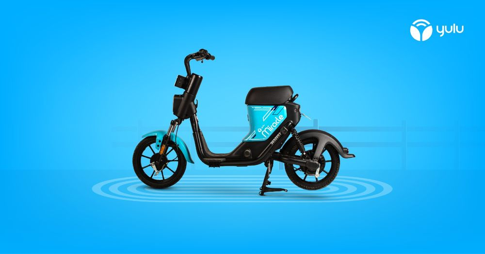

# 🚲 Yulu Business Case Study - Bike Rental Demand Analysis

## 📖 Overview  
Yulu is a bike-sharing service providing eco-friendly transportation in urban areas. However, rental demand fluctuates due to factors such as seasons, weather conditions, working days, and holidays. A lack of strategic planning can lead to inefficiencies in bike distribution, revenue loss, and user dissatisfaction.  

This project conducts an **end-to-end exploratory data analysis (EDA)** to identify key factors influencing bike rental demand and proposes **data-driven business recommendations** for optimizing Yulu’s operations and profitability.  

---
## 📊 **Dataset Information**  
📌 **Dataset Link:** [Yulu Rental Data](https://drive.google.com/file/d/1VHaryJdgXdb88lMUCYTm-_FfvGqp0SPM/view?usp=drive_link)  

## 🎯 **Project Objectives**  
This project aims to analyze historical bike rental data to:  

✔ **Identify Demand Patterns**: Understand how rental demand fluctuates across different seasons, weather conditions, and working days.  
✔ **Assess Impact of External Factors**: Analyze how temperature, humidity, and windspeed influence rental behavior.  
✔ **Optimize Bike Distribution**: Recommend strategies to deploy bikes effectively based on peak and off-peak rental periods.  
✔ **Enhance Pricing & Marketing Strategies**: Provide insights on dynamic pricing and promotional campaigns to maximize revenue.  
✔ **Improve Customer Experience**: Suggest operational improvements to increase user satisfaction and engagement.  
✔ **Boost Business Growth**: Explore additional revenue streams and innovative solutions for sustainable profitability.  

---

## 🗂 **Dataset Information**  
- **Source**: Yulu bike rental dataset (`bike_sharing.csv`)  
- **Rows**: 10,886  
- **Columns**: 12 (datetime, season, holiday, workingday, weather, temp, atemp, humidity, windspeed, casual, registered, count)  

**Key Features:**  
- `datetime` → Timestamp of bike rentals  
- `season` → Season of the year (Spring, Summer, Fall, Winter)  
- `holiday` → Whether the day is a holiday (Yes/No)  
- `workingday` → Whether the day is a working day (Yes/No)  
- `weather` → Weather conditions (Clear, Cloudy, Rainy, etc.)  
- `temp`, `atemp` → Temperature and "feels like" temperature  
- `humidity` → Humidity percentage  
- `windspeed` → Wind speed in km/h  
- `casual`, `registered` → Number of casual and registered users  
- `count` → Total number of bike rentals  

---

## 🏗 **Project Workflow**  

### 1️⃣ **Data Preprocessing & Cleaning**  
✔ Load dataset and check for missing values  
✔ Handle duplicate values and format datetime column  
✔ Convert categorical variables into meaningful labels  

### 2️⃣ **Exploratory Data Analysis (EDA)**  
✔ Summary statistics and distribution analysis  
✔ Visualizing trends (seasonal, hourly, and daily rental patterns)  
✔ Box plots to detect outliers in rental counts  
✔ Correlation heatmap to identify relationships between features  

### 3️⃣ **Statistical Analysis & Hypothesis Testing**  
✔ **Levene’s Test** - Checking variance equality  
✔ **Shapiro-Wilk Test** - Checking data normality  
✔ **Two-Sample T-Test** - Comparing working vs. non-working day rentals  
✔ **ANOVA & Kruskal-Wallis Test** - Analyzing demand across different seasons and weather conditions  
✔ **Chi-Square Test** - Checking dependency between season and weather  

---

## 🔍 **Key Findings & Insights**  

### **1️⃣ Seasonal and Monthly Trends**  
📌 **Peak Demand Months**: Rentals are highest in **June, July, and August** due to favorable weather conditions.  
📌 **Off-Peak Months**: Rentals decline significantly in **January, February, and March** due to colder temperatures.  
📌 **Winter Rentals**: Lower demand is observed in **December and January**, likely due to unfavorable riding conditions.  

**✅ Recommendation:**  
- Increase bike availability and marketing efforts during peak months.  
- Offer **discounts and promotions** in winter to encourage rentals.  

### **2️⃣ Impact of Weather Conditions**  
📌 **Rain and extreme weather** significantly reduce rentals.  
📌 **Sunny and clear weather** leads to higher demand.  
📌 Higher **windspeed and humidity** slightly reduce bike usage.  

**✅ Recommendation:**  
- Implement **weather-responsive pricing**, offering discounts on rainy days.  
- Promote **seasonal ride packages** for summer months.  

### **3️⃣ Working Days vs. Non-Working Days**  
📌 No significant difference in rentals between **working days and weekends**.  
📌 People rent bikes **throughout the week**, likely for both **commuting and leisure**.  

**✅ Recommendation:**  
- Maintain **consistent bike availability** throughout the week.  
- Introduce **weekday commuter plans** to attract regular users.  

### **4️⃣ User Behavior - Casual vs. Registered Users**  
📌 **Casual users** are more influenced by **season and weather**.  
📌 **Registered users** rent bikes **regularly** regardless of external conditions.  
📌 **Peak rental hours** are during **morning and evening commutes (8-9 AM & 5-7 PM)**.  

**✅ Recommendation:**  
- Provide **incentives for casual users** to become registered members.  
- Introduce **dynamic pricing** to maximize revenue during peak hours.  

### **5️⃣ Correlation Between Features**  
📌 **Temperature and "feels like" temperature (atemp) are strongly correlated** (0.98).  
📌 **Higher temperature leads to higher rentals**, while **humidity negatively affects rentals**.  
📌 **Casual and registered users** are strongly correlated with total rental counts.  

**✅ Recommendation:**  
- Use **predictive analytics** to estimate demand based on weather conditions.  
- Plan bike distribution based on **historical rental patterns**.  

---

## 💡 **Strategic Recommendations for Yulu's Profitable Growth**  

📌 **Optimize bike availability in high-demand months (June, July, August).**  
📌 **Introduce special promotions for off-peak months (January, February, March).**  
📌 **Implement dynamic pricing models based on weather conditions.**  
📌 **Launch commuter plans to encourage weekday rentals.**  
📌 **Enhance marketing campaigns to attract new registered users.**  
📌 **Expand partnerships with businesses, tourism agencies, and sponsors.**  

---

## 🔧 **Tech Stack Used**  
- **Programming Language**: Python 🐍  
- **Libraries**: Pandas, NumPy, Matplotlib, Seaborn, SciPy, StatsModels

---

